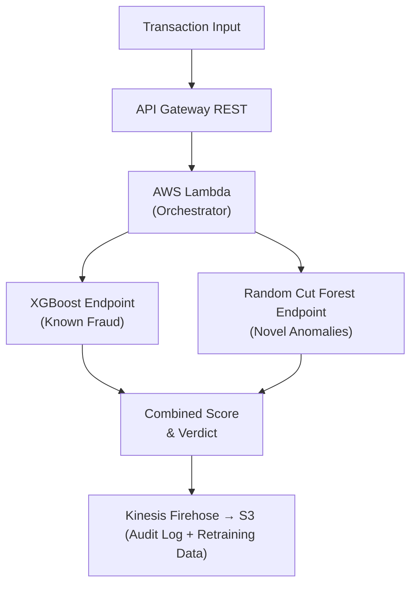

# 🛡️Credit Card Fraud Detection Using Amazon SageMaker

%2B?logo=SageMaker&logoColor=orange


A production-ready, end-to-end machine learning pipeline for real-time credit card fraud detection, deployed on Amazon SageMaker using XGBoost + SMOTE and Random Cut Forest.

## 📋Table of Contents
* Business Problem
* Solution Overview
* Architecture
* Dataset
* Models
* Model Performance
* Project Structure
* Prerequisites
* Quick Start
* Deployment
* Demo App
* Scenarios Tested
* Cost & Cleanup
##
## 💳 Business Problem
Credit card fraud costs the global payments industry over $32 billion annually, with losses projected to exceed $43 billion by 2028.

For a mid-sized bank processing 10 million transactions per day, even a 0.1% fraud rate translates to 10,000 fraudulent transactions daily — amounting to millions in chargebacks, investigation costs, and customer churn.

Financial institutions face three competing pressures:


| Challenge | Detail |
| :--- | :--- |
| **Real-time detection** | A fraudulent transaction must be flagged within milliseconds, before payment is authorised |
| **Minimize false positives** | 32% of customers abandon a card after just one false decline |
| **Class imbalance** | Fraud represents less than 0.2% of all transactions — traditional classifiers fail silently |
| **Model Performance** | High precision and recall are critical to balance detection with user experience |

## Who This Solves For

| Stakeholder | Why They Care |
| :--- | :--- |
| Banks & Payment Processors | Reduce chargebacks, meet PCI-DSS compliance, protect customer trust |
| E-commerce Platforms | Minimize payment fraud, reduce manual review queues |
| FinTech Startups | Deploy production-grade detection without building ML infrastructure |
| Insurance Companies | Apply same anomaly detection patterns to claims fraud |
---
## 🧠 Solution Overview
This project implements a dual-model fraud detection architecture that mirrors real-world production systems:

* __Random Cut Forest (RCF)__— Unsupervised anomaly detector. Catches novel, never-before-seen fraud patterns without labeled data.
* __XGBoost + SMOTE__ — Supervised classifier trained on historical fraud labels. Recognizes known fraud signatures with high precision.
Combining both provides __defense__ in depth: XGBoost catches fraud that looks like past fraud; RCF catches fraud that looks like nothing legitimate.

## Business Requirements Met

| # | Requirement | Target | Achieved |
| :--- | :--- | :--- | :--- |
| 1 | Real-time scoring | < 100ms | ✅ |
| 2 | High recall on fraud | ≥ 80% | ✅ 80% |
| 3 | High precision | ≥ 90% | ✅ 93% |
| 4 | Scalability | 10,000+ TPS | ✅ SageMaker auto-scaling |
| 5 | Audit logging | Every prediction logged | ✅ Kinesis → S3 |
| 6 | Reproducible infra | One-click deploy | ✅ CloudFormation |
---
## 🏗️ Architecture

## AWS Services Used
Layer	Service	Purpose
Data Storage	Amazon S3	Patient CSV datasets and model artefacts
Model Training	SageMaker Notebook + XGBoost	Training jobs with SMOTE rebalancing
Anomaly Detection	SageMaker RCF	Unsupervised novelty detection
Model Serving	SageMaker Endpoints	Real-time prediction API (< 100ms)
Orchestration	AWS Lambda	Invokes endpoints, returns combined verdict
API Layer	Amazon API Gateway	REST interface for client applications
Audit Streaming	Amazon Kinesis Firehose	Streams every prediction to S3
Infrastructure	AWS CloudFormation	Full stack as reproducible code
Demo UI	Gradio	Scenario-based interactive testing
## 📊 Dataset
ULB Credit Card Fraud Detection Dataset — Kaggle
| Attribute | Detail |
| :--- | :--- |
| Records | 284,807 transactions |
| Features | 30 (Time, V1–V28 PCA-transformed, Amount) |
| Fraud cases | 492 (0.172% of total) |
| Time period | Two days of European cardholder transactions, September 2013 |
| Privacy | V1–V28 are PCA-transformed to protect cardholder identity |

> ⚠️ The dataset (`creditcard.csv`, 143 MB) is excluded from this repository due to GitHub's file size limit. Download it from [Kaggle](https://kaggle.com) and place it at `notebooks/creditcard.csv`.

## 🤖 Models
__1. XGBoost + SMOTE (Primary Classifier)__
XGBoost is trained on labeled transaction data with SMOTE (Synthetic Minority Oversampling Technique) applied to address the severe class imbalance (0.172% fraud).

Key hyperparameters:
```python
max_depth         = 5
eta               = 0.2
subsample         = 0.8
scale_pos_weight  = 1  # overridden by SMOTE rebalancing
objective         = binary:logistic
num_round         = 150
```
## 2. Random Cut Forest (Anomaly Detector)
An unsupervised model that learns the statistical structure of normal transactions and flags deviations — enabling detection of **new fraud patterns never seen during training.**
```python
num_trees        = 50
num_samples_per_tree = 256
feature_dim      = 30
```
## Why Two Models?

| | XGBoost | Random Cut Forest |
| :--- | :--- | :--- |
| **Type** | Supervised | Unsupervised |
| **Learns from** | Labeled fraud history | Statistical normality |
| **Catches** | Known fraud patterns | Novel, unseen anomalies |
| **Weakness** | Blind to new attack vectors | Higher false positive rate |
| **Strength** | High precision on known fraud | Future-proof coverage |

## 📈 Model Performance
Evaluated on a held-out test set (20% of 284,807 transactions):


| Metric | Base XGBoost | XGBoost + SMOTE | Improvement |
| :--- | :--- | :--- | :--- |
| **Precision** | 91% | **93%** | +2% |
| **Recall** | 78% | **80%** | +2% |
| **F1 Score** | 84% | **86%** | +2% |
| **AUC-ROC** | ~0.97 | **~0.98** | +0.01 |
| **F2 Score** | 71% | **83%** | +12% |

> At 10M daily transactions, a +2% recall improvement catches thousands of additional fraudulent transactions per day.

## 📁 Project Structure
```text
fraud-detection-sagemaker/
│
├── notebooks/
│   ├── sagemaker_fraud_detection.ipynb   # Main training notebook
│   ├── endpoint_demo.ipynb              # Endpoint invocation demo
│   ├── fraud_detection_gradio.py         # Interactive Gradio demo app
│   ├── fraud_dashboard.png               # Performance dashboard
│   ├── requirements.txt                  # Python dependencies
│   ├── requirements.in                   # Pip-compile source
│   ├── setup.py                          # Package setup
│   └── src/
│       └── package/
│           ├── __init__.py
│           ├── config.py                 # Endpoint names & config
│           ├── utils.py                  # Helper functions
│           └── generate_endpoint_traffic.py
│
├── lambda/
│   └── model-invocation/                 # Lambda function source
│
├── scripts/                              # Utility scripts
│
├── test/                                 # Test cases
│
├── env_setup.py                          # Environment bootstrap
├── fraud-detection-using-machine-learning.yaml # CloudFormation stack
└── README.md
```
---
## ✅ Prerequisites
AWS Account with SageMaker, Lambda, API Gateway, Kinesis, and S3 permissions
Python 3.8+
AWS CLI configured (aws configure)
Kaggle account to download the dataset
### Python Dependencies
pip install -r notebooks/requirements.txt
Key packages:

boto3>=1.26
sagemaker>=2.100
pandas>=1.5
numpy>=1.23
scikit-learn>=1.1
imbalanced-learn>=0.10   # SMOTE
xgboost>=1.7
gradio>=3.40
matplotlib>=3.6
seaborn>=0.12
🚀 Quick Start
1. Clone the Repository
git clone https://github.com/MAOFILHO/fraud-detection-sagemaker.git
cd fraud-detection-sagemaker
2. Download the Dataset
Download creditcard.csv from Kaggle and place it in:

notebooks/creditcard.csv
3. Set Up SageMaker Environment
Launch the training notebook in your SageMaker Notebook Instance or SageMaker Studio:

# From SageMaker terminal
cd /home/ec2-user/SageMaker/notebooks
jupyter notebook sagemaker_fraud_detection.ipynb
4. Run the Notebook End-to-End
The notebook walks through:

Data loading and exploratory analysis
SMOTE oversampling for class balancing
XGBoost training job on SageMaker
Random Cut Forest training job
Model evaluation and comparison
Endpoint deployment
Real-time prediction testing
☁️ Deployment
Option A — CloudFormation (Recommended)
Deploy the full infrastructure stack with one command:

aws cloudformation create-stack \
  --stack-name fraud-detection-stack \
  --template-body file://fraud-detection-using-machine-learning.yaml \
  --capabilities CAPABILITY_IAM \
  --parameters \
    ParameterKey=SolutionPrefix,ParameterValue=sagemaker-soln-fdml- \
    ParameterKey=CreateSageMakerNotebookInstance,ParameterValue=true
This provisions:

S3 buckets (model data + output)
SageMaker Notebook Instance
Lambda function (event-processor)
API Gateway (REST, IAM-authenticated)
Kinesis Firehose delivery stream → S3
All IAM roles and permissions
Option B — Manual Endpoint Deployment
From inside the notebook:

import sagemaker
from sagemaker.xgboost import XGBoostModel

model = XGBoostModel(
    model_data="s3://your-bucket/model.tar.gz",
    role=sagemaker.get_execution_role(),
    framework_version="1.7-1"
)

predictor = model.deploy(
    initial_instance_count=1,
    instance_type="ml.t2.medium",
    endpoint_name="sagemaker-soln-fdml--xgb-smote"
)
Endpoint Names
Model	Endpoint Name
XGBoost + SMOTE	sagemaker-soln-fdml--xgb-smote
Base XGBoost	sagemaker-soln-fdml--xgb-2026-05-04-09-35-13-752
🎮 Demo App
An interactive Gradio app lets you test both models against 8 real transaction scenarios from the ULB dataset — no API knowledge required.

Run the Demo
cd notebooks/
pip install gradio boto3
python fraud_detection_gradio.py
The app launches at http://localhost:7860 and also provides a public share link.

Available Scenarios
Scenario	Amount	Expected
🛒 Grocery store	$149.62	✅ Legitimate
☕ Coffee shop	$2.69	✅ Legitimate
🍕 Restaurant	$1.98	✅ Legitimate
🚌 Transport fare	$7.28	✅ Legitimate
🚨 Stolen card — $0 probe	$0.00	🔴 FRAUD
🚨 Overseas ATM	$529.00	🔴 FRAUD
🚨 Card testing micro-charge #1	$1.00	🔴 FRAUD
🚨 Card testing micro-charge #2	$1.00	🔴 FRAUD
Each scenario uses a real row from the ULB dataset — predictions reflect actual model behaviour on production data.

💡 Extending This Project
The architecture transfers directly to other imbalanced classification problems:

🏥 Medical diagnosis — rare disease detection from patient records
🔒 Network intrusion detection — anomaly-based cybersecurity
🚗 Insurance claims fraud — same dual-model pattern
⚙️ Predictive maintenance — equipment failure from sensor data
💰 Cost & Cleanup
⚠️ SageMaker endpoints incur charges while running (~$0.056/hour for ml.t2.medium). Delete them when not in use.

Delete Endpoints
import boto3
sm = boto3.client("sagemaker")

sm.delete_endpoint(EndpointName="sagemaker-soln-fdml--xgb-smote")
sm.delete_endpoint(EndpointName="sagemaker-soln-fdml--xgb-2026-05-04-09-35-13-752")
Delete CloudFormation Stack
aws cloudformation delete-stack --stack-name fraud-detection-stack
Estimated Costs (Single Run)
Resource	Estimated Cost
SageMaker Training (2 jobs, ml.m5.xlarge, ~20 min each)	~$0.30
SageMaker Endpoint (ml.t2.medium, 1 hour)	~$0.056
S3 Storage (model artefacts)	~$0.01
Lambda + API Gateway (demo calls)	< $0.01
Total	< $0.40
📚 References
ULB Credit Card Fraud Dataset — Kaggle
Amazon SageMaker XGBoost Documentation
Amazon SageMaker Random Cut Forest
SMOTE — imbalanced-learn
AWS CloudFormation Fraud Detection Solution (SO0056)
🙏 Acknowledgements
ULB Machine Learning Group — for the anonymised credit card dataset
AWS SageMaker Team — for the open-source CloudFormation solution template (SO0056)
📄 License
This project is licensed under the MIT License. See LICENSE for details.
